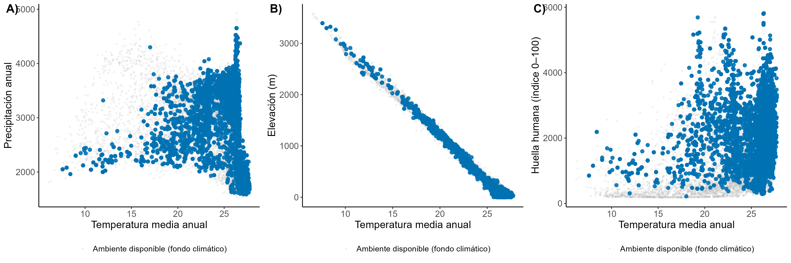
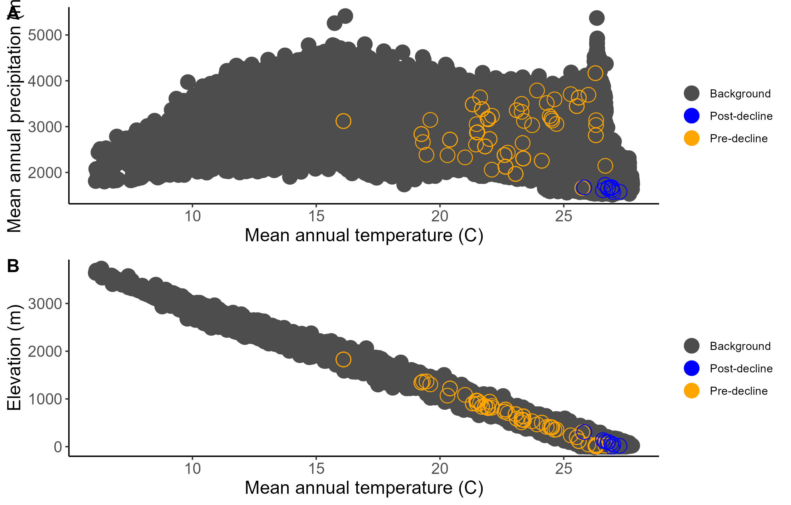
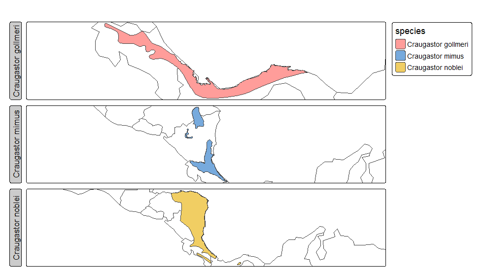

# José Miguel Pacheco Sibaja

## Description
I am a tropical biology student with a passion for birds of prey in the neotropic, literature and writing—particularly dark fantasy novels. I am also a tourism student; very interested in combining the knowledge I can gain through the study of the natural world with tourism, in hopes of reaching more people with practices that promote environmental conservation.

## Project
* Currently writing the first book of a trilogy under the pseudonym J.M. Pendrake.

## Education
* **Bachelor's in Biology with an emphasis in Tropical Biology** - Universidad Nacional de Costa Rica — Ongoing.
* **Diploma in Eco-touristic management** - Universidad Técnica Nacional — Ongoing.
* **High-school diploma** Centro Educativo Horizontes - 2018

## Languages
* Spanish: Native
* English: Native
* Japanese: N4

## Hobbies
* Reading.
* Writing (Pseudonym J.M. Pendrake).
* Hiking.
* Bird watching.

## Contact Information
* [**Email**](mailto:jmpachecosibaja@gmail.com)
* [**Writer Email**](mailto:jmpendrake@gmail.com)
* [**ORCID**](https://orcid.org/0009-0003-4801-0531)

---
# Some of my Work

### Figure 1. Temporal distribution of _Pandion haliaetus_ records in Costa Rica. The records are distinguished by date, with blue points representing observations prior to the year 2000, and orange points representing observations made from the year 2000 onward.

### Figure 2. Environmental relationships of _Pandion haliaetus_ with climatic, topographic, and anthropogenic variables.
Panel A shows the relationship between mean annual temperature and annual precipitation.
Panel B represents the relationship between temperature and elevation.
Panel C shows the relationship between temperature and human footprint (index 0–100).

### Figure 3. Density of observations by geographic coordinates (latitude and longitude) of _Pandion haliaetus_ in Costa Rica. The density curves represent the spatial distribution of observation records according to geographic coordinates (left panel: longitude; right panel: latitude).

### Figure 4. Climatic and elevational space of pre-decline and post-decline records of Ranoides species

### Figure 5. Geographic distribution ranges of _Craugastor gollmeri_, _C. mimus_, and _C. noblei_ across Central American countries.

[Visit Github](https://github.com/JPachecoSibaja/jpacheco_sibaja.github.io)
